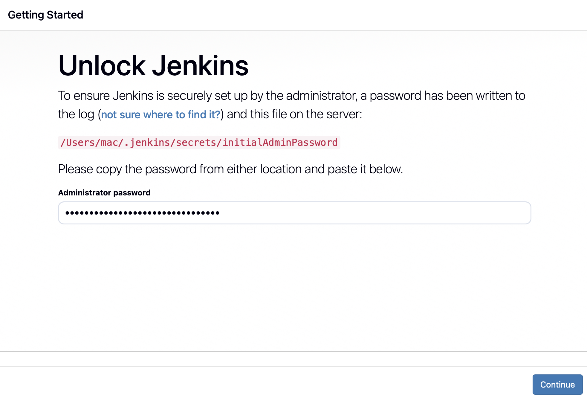
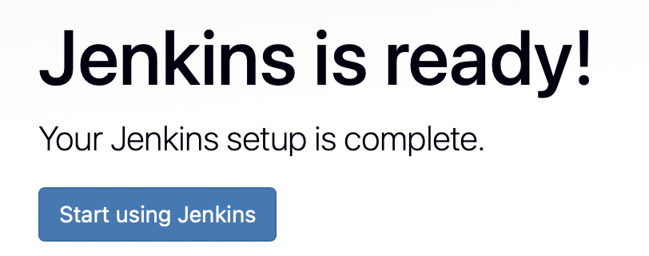
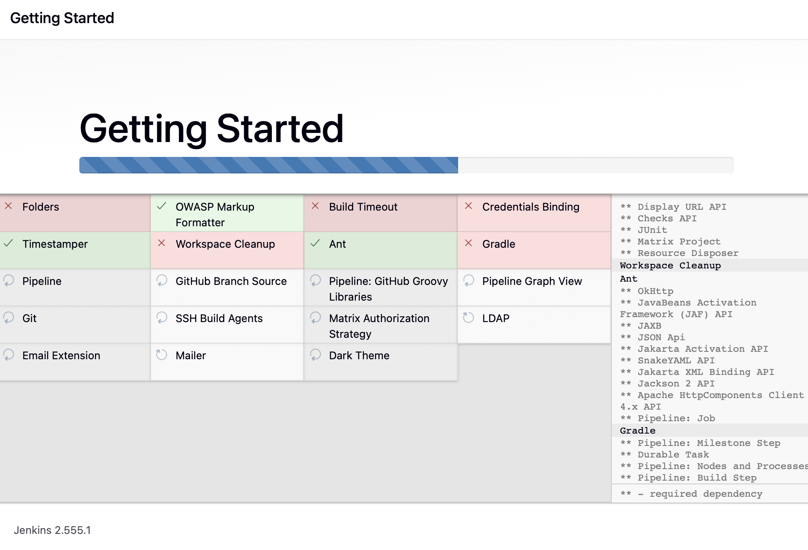
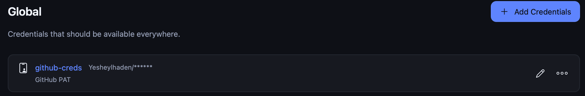
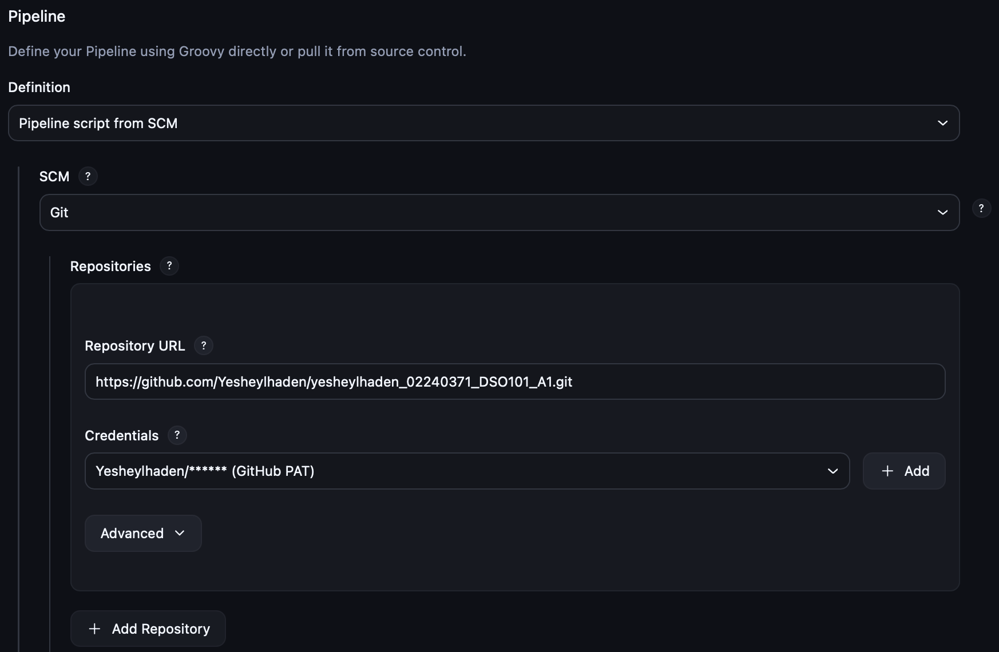
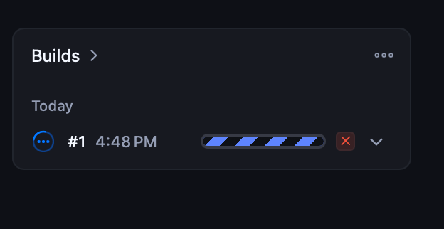
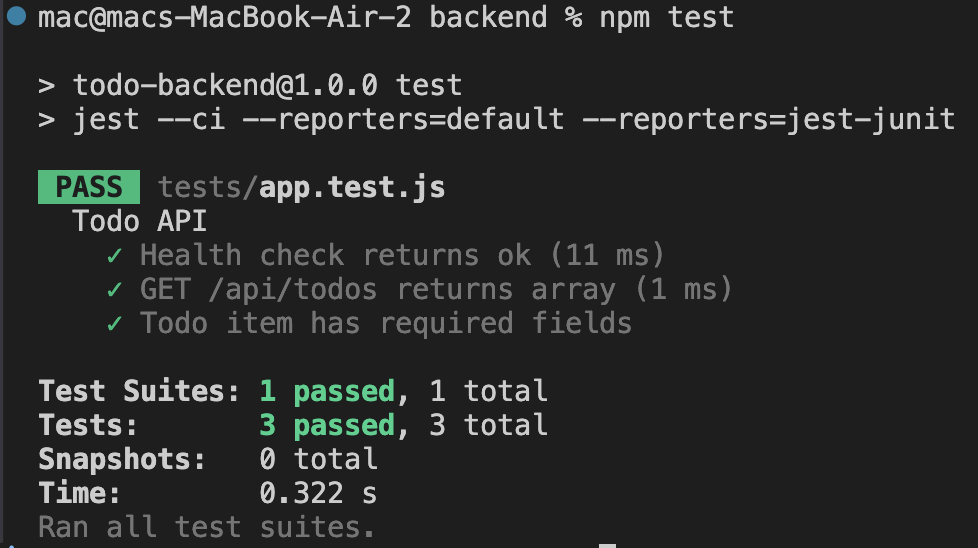
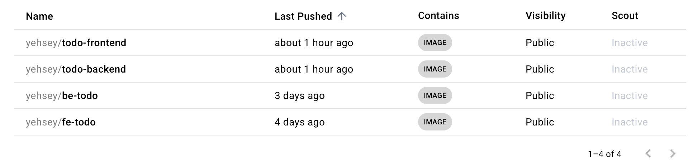

# Assignment 2 - Jenkins CI/CD Pipeline
**Name:** Yeshey Lhaden  
**Student ID:** 02240371  
**GitHub Repo:** https://github.com/Yesheylhaden/yesheylhaden_02240371_DSO101_A1  
**Docker Hub:** https://hub.docker.com/u/yehsey

---

## How I Configured the Pipeline

### Step 1 - Installed and Unlocked Jenkins
I installed Jenkins using Homebrew on Mac and accessed it at `http://localhost:8080`. I retrieved the initial admin password from the terminal and unlocked Jenkins.

---

### Step 2 - Installed Plugins
Jenkins installed suggested plugins automatically during setup. Due to slow internet, some plugins failed and were downloaded manually via terminal using `curl` commands into `~/.jenkins/plugins/`.

---

### Step 3 - Created Admin User
After plugin installation, I created the first admin user with full name `Yeshey Lhaden`.

---

### Step 4 - Configured NodeJS in Jenkins Tools
I went to **Manage Jenkins → Tools → NodeJS installations** and added NodeJS version `20.9.0` named `NodeJS` so the pipeline could run npm commands.

---

### Step 5 - Created GitHub Personal Access Token
I generated a GitHub PAT with `repo` and `admin:repo_hook` permissions to allow Jenkins to access my GitHub repository securely.

---

### Step 6 - Added Credentials to Jenkins
I added two credentials under **Manage Jenkins → Credentials → Global**:
- `github-creds` — GitHub username + PAT
- `docker-hub-creds` — Docker Hub username + password

---

### Step 7 - Configured the Pipeline Job
I created a new Pipeline job named `todo-app-pipeline` and set it to pull the Jenkinsfile from my GitHub repo on the `main` branch using `github-creds`.

---

### Step 8 - Ran the Pipeline
I clicked **Build Now**. The pipeline ran successfully on Build #14. All stages passed including tests and Docker deployment.

---

### Step 9 - Test Results in Jenkins
Jenkins displayed test results showing all 3 backend API tests passing with 0 failures and 0 skipped.

---

### Step 10 - Docker Images Pushed to Docker Hub
Both Docker images were successfully built and pushed to Docker Hub.

- **Backend:** https://hub.docker.com/r/yehsey/todo-backend  
- **Frontend:** https://hub.docker.com/r/yehsey/todo-frontend

---

## Challenges Faced

### Problem 1 – Jenkins not loading on localhost:8080
Even though Jenkins was active, the browser did not show any results. This problem occurred because the value in the plist file config file was “httpListenAddress = 127.0.0.1”, which means that “http://127.0.0.1:8080” works,

### Challenge 2 – Plugin Installation Timeouts
When I was trying to install the Jenkins plugins, they were continuously timing out. I was able to overcome this problem by downloading the necessary .hpi files manually from the terminal and saving them in ~/.jenkins/plugins/ directory.

### Challenge 3 – Cannot Find Docker in Jenkins
Though Docker Desktop was installed on my computer, Jenkins couldn't find it; it would throw a `docker: command not found` error message. Jenkins runs as a daemon without the PATH variable set. Thus, I needed to use the complete file path /usr/local/bin/docker in all commands used inside the Jenkinsfile.

### Challenge 4 – Docker Credential Helper
I encountered an issue where Jenkins was unable to find docker-credential-desktop. It would return me an error: `exec: "docker-credential-desktop": executable file not found.` The problem could be solved by removing the credsStore parameter from the JSON config file located at ~/.docker/config.json.

### Challenge 5 – Docker Hub Push Failure (Error 400)
The push failed due to the fact that the repositories in Docker Hub were still missing, and the credentials stored were using a password that was incorrect. Once the repository was created, and the password updated to the correct one in Jenkins, the push was successful.

## Conclusion
In this assignment, I gained practical experience creating a CI/CD pipeline for a full-stack Todo List application using Jenkins. This assignment taught me how to apply the DevOps approach in practice by automating builds, tests, and deployments.
In particular, during this assignment, I got a better understanding of how Jenkins pipelines function from code checkout to Docker image deployment. The creation of the Jenkinsfile including such steps as the installation of dependencies, building the React front-end, running backend unit tests using Jest and the deployment of Docker images on Docker Hub allowed me to gain knowledge about the structure of modern software delivery pipelines.
One of the major lessons I have learned throughout this assignment was debugging. During the process, I encountered several issues that included problems with plugin downloads, Docker command unavailable in Jenkins, and other problems that forced me to do thorough research.
Overall, with this assignment, I learned why CI/CD pipelines are important in software engineering since they save time, reduce risks associated with human error, and help deliver high-quality code into production faster.