# DSO101 Assignment 1 — Containerization & Deployment

**Student:** Yeshey Lhaden  
**Student ID:** 02240371  
**Repository Folder:** `yesheylhaden_02240371_DSO101_A1`
**git hub link:**  https://github.com/Yesheylhaden/yesheylhaden_02240371_DSO101_A1.git

---

## Table of Contents

- [Step 0 — Prerequisite: Building the Todo App](#step-0--prerequisite-building-the-todo-app)
- [Part A — Deploying a Pre-built Docker Image](#part-a--deploying-a-pre-built-docker-image)
  - [A1. Build & Push Docker Images](#a1-build--push-docker-images)
  - [A2. Deploy on Render.com](#a2-deploy-on-rendercom)
- [Part B — Automated Image Build and Deployment](#part-b--automated-image-build-and-deployment)

---

## Step 0 — Prerequisite: Building the Todo App

A full-stack Todo List web application was built using the following tech stack:

| Layer | Technology |
|---|---|
| Frontend | React.js |
| Backend | Node.js + Express |
| Database | PostgreSQL |

### Environment Variables

The backend was configured with a `.env` file containing:

```env
DB_HOST=dpg-d7nose2qqhas7381vaj0-a.singapore-postgres.render.com
DB_USER=todo_db_55ct_user
DB_PASSWORD=Wyvovcc6VZLZf0H0lDmirHVIeYz6QpNF
DB_NAME=todo_db_55ct
DB_PORT=5432
DB_SSL=true
PORT=5000
```

The frontend was configured with:

```env
REACT_APP_API_URL=https://be-todo-02240371.onrender.com
```

> `.env` was added to `.gitignore` to ensure credentials were never committed to the repository.

The application was tested locally before proceeding to deployment. The backend logs confirmed a successful connection to PostgreSQL and the tasks table was initialized correctly.

**Screenshot: Backend running locally and connected to PostgreSQL**


---

## Part A — Deploying a Pre-built Docker Image

### A1. Build & Push Docker Images

#### Backend Image

The backend Dockerfile was created at `./backend/Dockerfile`:

```dockerfile
# backend/Dockerfile
FROM node:18-alpine
WORKDIR /app
COPY package*.json ./
RUN npm install
COPY . .
EXPOSE 5000
CMD ["node", "server.js"]
```

The image was built using the student ID `02240371` as the tag:

```bash
docker build -t yehsey/be-todo:02240371 .
```

**Screenshot: Backend Docker image build — FINISHED**


The image was then pushed to Docker Hub:

```bash
docker push yehsey/be-todo:02240371
```

**Screenshot: Backend image pushed to Docker Hub**


---

#### Frontend Image

The frontend Dockerfile used a multi-stage build with Node.js to build the React app and Nginx to serve it:

```bash
docker build -t yehsey/fe-todo:02240371 .
```

**Screenshot: Frontend Docker image build — FINISHED**


The frontend image was then pushed:

```bash
docker push yehsey/fe-todo:02240371
```

**Screenshot: Frontend image pushed to Docker Hub**


---

#### Docker Hub Repositories

Both images were successfully pushed and are publicly visible under the `yehsey` namespace on Docker Hub.

**Screenshot: Docker Hub showing both repositories**


---

### A2. Deploy on Render.com

#### Database — Render PostgreSQL

A managed PostgreSQL database was created on Render with the following configuration:

| Field | Value |
|---|---|
| Name | `todo-db` |
| Database | `todos` |
| Region | Singapore |

**Screenshot: Creating a new PostgreSQL database on Render**


After creation, the connection credentials were retrieved from the Render PostgreSQL dashboard:

| Field | Value |
|---|---|
| Database | `todo_db_55ct` |
| Username | `todo_db_55ct_user` |
| Port | `5432` |

**Screenshot: Render PostgreSQL connection credentials**


---

#### Backend Service

A Web Service was created on Render using the existing Docker Hub image:

- **Image:** `yehsey/be-todo:02240371`
- **Service URL:** `https://be-todo-02240371.onrender.com`

The following environment variables were configured for the backend service:

| Key | Value |
|---|---|
| `DB_HOST` | `dpg-d7nose2qqhas7381vaj0-a.singapore-postgres.render.com` |
| `DB_NAME` | `todo_db_55ct` |
| `DB_USER` | `todo_db_55ct_user` |
| `DB_PASSWORD` | `Wyvovcc6VZLZf0H0lDmirHVIeYz6QpNF` |
| `DB_PORT` | `5432` |
| `DB_SSL` | `true` |
| `PORT` | `5000` |

**Screenshot: Backend environment variables on Render**


**Screenshot: Backend service deployed successfully on Render**


---

#### Frontend Service

A Web Service was created for the frontend using the Docker Hub image:

- **Image:** `yehsey/fe-todo:02240371`
- **Service URL:** `https://fe-todo-02240371.onrender.com`

The following environment variable was configured:

| Key | Value |
|---|---|
| `REACT_APP_API_URL` | `https://be-todo-02240371.onrender.com` |

**Screenshot: Frontend environment variable on Render**


**Screenshot: Frontend service deployed successfully on Render**


---

## Part B — Automated Image Build and Deployment

### Repository Structure

The project repository was organized as follows:

```
yehseylhaden_02240371_DSO101_A1/
├── frontend/
│   ├── Dockerfile
│   ├── .env.production
│   └── src/
├── backend/
│   ├── Dockerfile
│   ├── .env.production
│   └── server.js
└── render.yaml
```

### render.yaml — Blueprint Configuration

A `render.yaml` file was created at the root of the repository to orchestrate the automated multi-service deployment:

```yaml
services:
  # Backend Service
  - type: web
    name: be-todo
    env: docker
    dockerfilePath: ./backend/Dockerfile
    envVars:
      - key: DB_HOST
        value: dpg-d7nose2qqhas7381vaj0-a.singapore-postgres.render.com
      - key: DB_USER
        value: todo_db_55ct_user
      - key: DB_PASSWORD
        value: your-db-password
      - key: DB_NAME
        value: todo_db_55ct
      - key: DB_PORT
        value: 5432
      - key: DB_SSL
        value: true
      - key: PORT
        value: 5000

  # Frontend Service
  - type: web
    name: fe-todo
    env: docker
    dockerfilePath: ./frontend/Dockerfile
    envVars:
      - key: REACT_APP_API_URL
        value: https://be-todo.onrender.com

databases:
  - name: todo-db
    databaseName: todo
    user: todo_user
```

### How Automated Deployment Works

1. The code updates get committed to the GitHub repository.
2. The Render platform picks up the new update because it is linked to the GitHub integration.
3. The Render system creates a new Docker image by using the `Dockerfile` in the service folders.
4. This image replaces the old one and gets deployed without any additional steps on your part.
The fact that each update in the GitHub repository leads to a new build and deploy is very convenient.
---

## Conclusion
The current assignment gave hands-on experience in building containers for full-stack web applications with Docker and deploying them on Render.com. The process of developing the Todo application from scratch and moving from image deployment in Part A to CI/CD deployment in Part B was enlightening in terms of real-world deployment processes.
The application was run using Docker to ensure consistency, while the blueprints setup with the render.yaml file showed how automatic deployments could be carried out for multi-service deployment with each git push. Also, the use of environment variables during deployment emphasized the need for secure handling of credentials in any project.
In general, this assignment gave insight into both local and production deployment of applications.# CI/CD Pipeline

---

# Assignment 2 - Jenkins CI/CD Pipeline
**Name:** Yeshey Lhaden  
**Student ID:** 02240371  
**GitHub Repo:** https://github.com/Yesheylhaden/yesheylhaden_02240371_DSO101_A1  
**Docker Hub:** https://hub.docker.com/u/yehsey

---

## How I Configured the Pipeline

### Step 1 - Installed and Unlocked Jenkins
I installed Jenkins using Homebrew on Mac and accessed it at `http://localhost:8080`. I retrieved the initial admin password from the terminal and unlocked Jenkins.


---

### Step 2 - Installed Plugins
Jenkins installed suggested plugins automatically during setup. Due to slow internet, some plugins failed and were downloaded manually via terminal using `curl` commands into `~/.jenkins/plugins/`.


---

### Step 3 - Created Admin User
After plugin installation, I created the first admin user with full name `Yeshey Lhaden`.

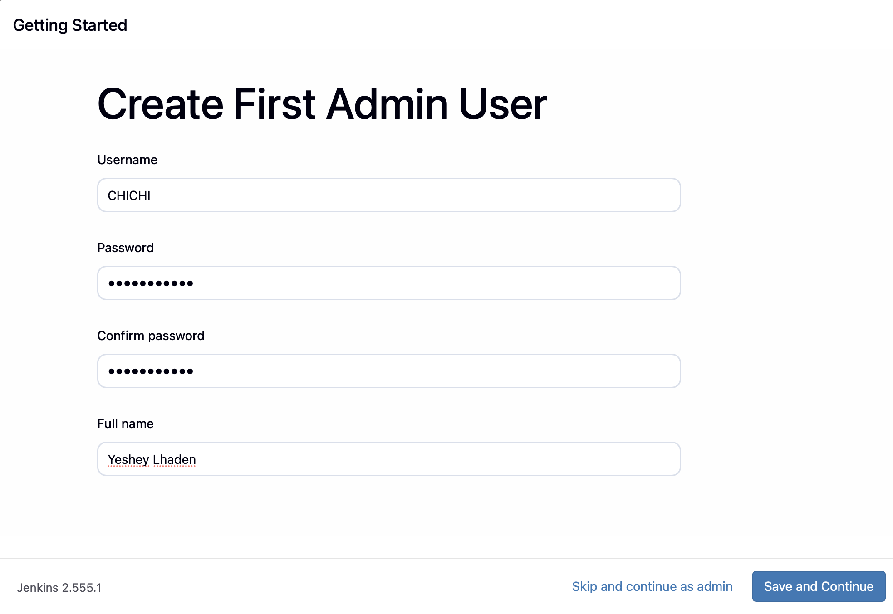

---

### Step 4 - Configured NodeJS in Jenkins Tools
I went to **Manage Jenkins → Tools → NodeJS installations** and added NodeJS version `20.9.0` named `NodeJS` so the pipeline could run npm commands.

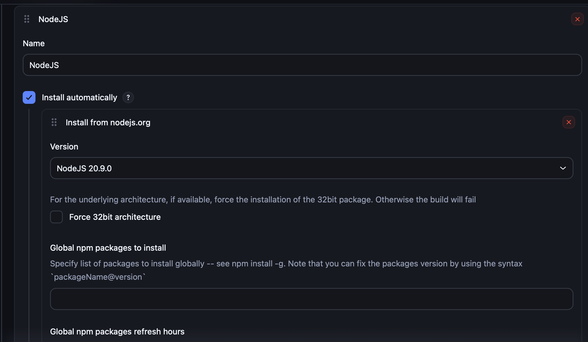

---

### Step 5 - Created GitHub Personal Access Token
I generated a GitHub PAT with `repo` and `admin:repo_hook` permissions to allow Jenkins to access my GitHub repository securely.


---

### Step 6 - Added Credentials to Jenkins
I added two credentials under **Manage Jenkins → Credentials → Global**:
- `github-creds` — GitHub username + PAT
- `docker-hub-creds` — Docker Hub username + password

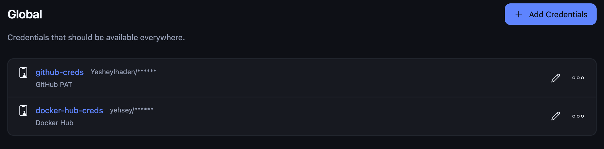

---

### Step 7 - Configured the Pipeline Job
I created a new Pipeline job named `todo-app-pipeline` and set it to pull the Jenkinsfile from my GitHub repo on the `main` branch using `github-creds`.


---

### Step 8 - Ran the Pipeline
I clicked **Build Now**. The pipeline ran successfully on Build #14. All stages passed including tests and Docker deployment.


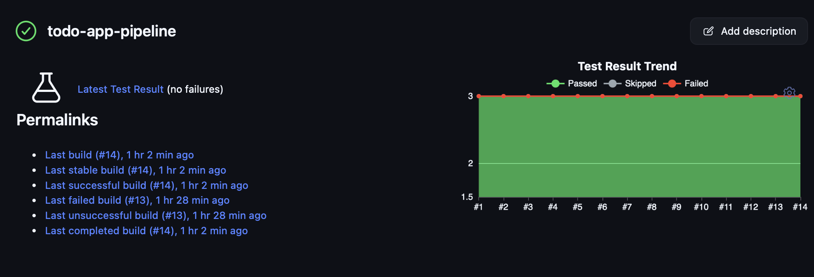

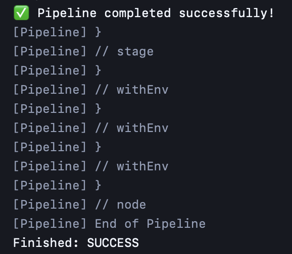

---

### Step 9 - Test Results in Jenkins
Jenkins displayed test results showing all 3 backend API tests passing with 0 failures and 0 skipped.


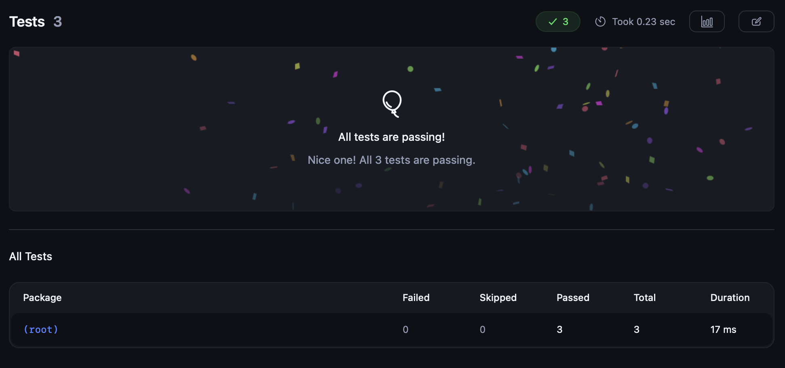

---

### Step 10 - Docker Images Pushed to Docker Hub
Both Docker images were successfully built and pushed to Docker Hub.


- **Backend:** https://hub.docker.com/r/yehsey/todo-backend  
- **Frontend:** https://hub.docker.com/r/yehsey/todo-frontend

---

## Challenges Faced

### Problem 1 – Jenkins not loading on localhost:8080
Even though Jenkins was active, the browser did not show any results. This problem occurred because the value in the plist file config file was “httpListenAddress = 127.0.0.1”, which means that “http://127.0.0.1:8080” works,

### Challenge 2 – Plugin Installation Timeouts
When I was trying to install the Jenkins plugins, they were continuously timing out. I was able to overcome this problem by downloading the necessary .hpi files manually from the terminal and saving them in ~/.jenkins/plugins/ directory.

### Challenge 3 – Cannot Find Docker in Jenkins
Though Docker Desktop was installed on my computer, Jenkins couldn't find it; it would throw a `docker: command not found` error message. Jenkins runs as a daemon without the PATH variable set. Thus, I needed to use the complete file path /usr/local/bin/docker in all commands used inside the Jenkinsfile.

### Challenge 4 – Docker Credential Helper
I encountered an issue where Jenkins was unable to find docker-credential-desktop. It would return me an error: `exec: "docker-credential-desktop": executable file not found.` The problem could be solved by removing the credsStore parameter from the JSON config file located at ~/.docker/config.json.

### Challenge 5 – Docker Hub Push Failure (Error 400)
The push failed due to the fact that the repositories in Docker Hub were still missing, and the credentials stored were using a password that was incorrect. Once the repository was created, and the password updated to the correct one in Jenkins, the push was successful.

## Conclusion
In this assignment, I gained practical experience creating a CI/CD pipeline for a full-stack Todo List application using Jenkins. This assignment taught me how to apply the DevOps approach in practice by automating builds, tests, and deployments.
In particular, during this assignment, I got a better understanding of how Jenkins pipelines function from code checkout to Docker image deployment. The creation of the Jenkinsfile including such steps as the installation of dependencies, building the React front-end, running backend unit tests using Jest and the deployment of Docker images on Docker Hub allowed me to gain knowledge about the structure of modern software delivery pipelines.
One of the major lessons I have learned throughout this assignment was debugging. During the process, I encountered several issues that included problems with plugin downloads, Docker command unavailable in Jenkins, and other problems that forced me to do thorough research.
Overall, with this assignment, I learned why CI/CD pipelines are important in software engineering since they save time, reduce risks associated with human error, and help deliver high-quality code into production faster.

---

# DSO101 Assignment 3 – CI/CD Pipeline with GitHub Actions, Docker & Render

**Student Name:** Yesheylhaden  
**Student ID:** 02240371  
**Repository:** [yesheylhaden_02240371_DSO101_A1](https://github.com/Yesheylhaden/yesheylhaden_02240371_DSO101_A1)  
**Live Deployment:** [https://todo-app-latest-kzjw.onrender.com](https://todo-app-latest-kzjw.onrender.com)

---

## Objective

In this task, we were required to configure a CI/CD pipeline that could:
1. Automatically create a Docker image for the Node.js Todo Backend Application
2. Publish the created image to DockerHub
3. Automate the deployment process on Render.com through GitHub Actions

---

## Tools & Technologies Used

| Tool | Purpose |
|---|---|
| GitHub | Source code hosting |
| GitHub Actions | CI/CD automation |
| Docker & Docker Compose | Containerization |
| DockerHub | Container image registry |
| Render.com | Cloud deployment platform |
| Neon.tech | Cloud PostgreSQL database |
| Node.js & Express | Backend runtime and API framework |
| Jest | Testing framework |

---

## Task 1: GitHub Repository Setup

The Node.js Todo backend git repo used was found to be **public** on GitHub. The file `package.json` had been found to have all required scripts present.

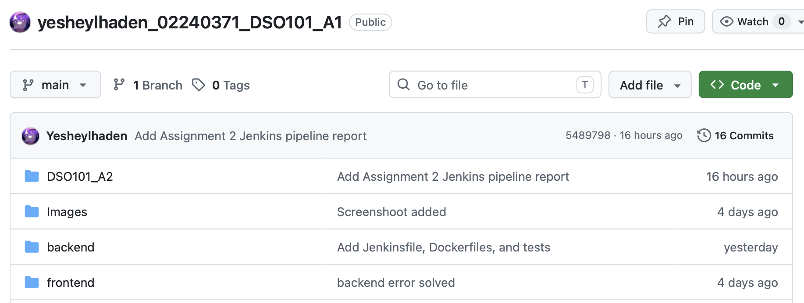

### package.json Scripts

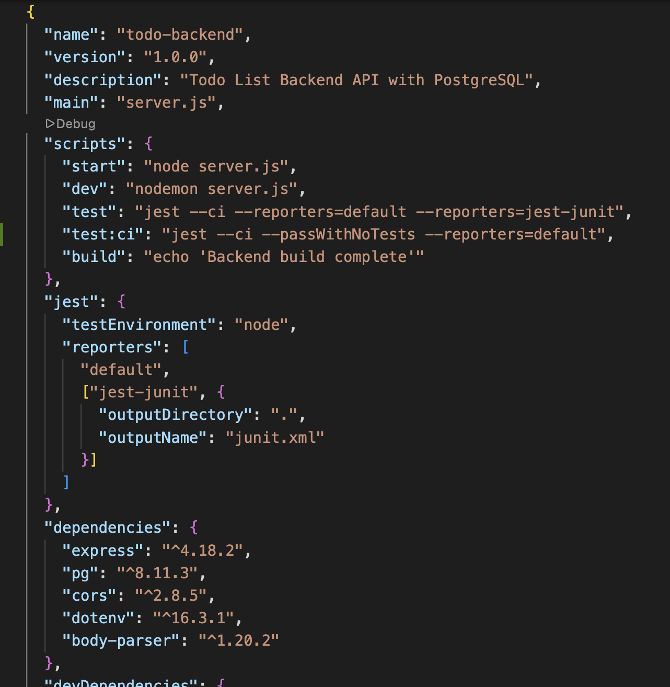

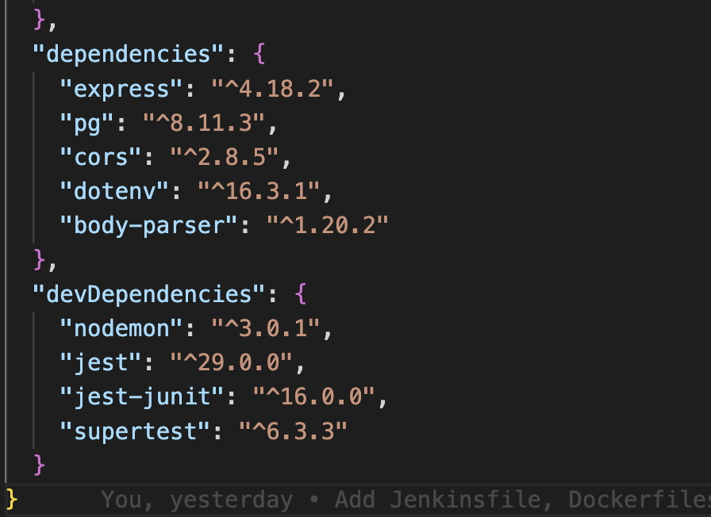

---

## Task 2: Dockerizing the Application

### Dockerfile

A `Dockerfile` was created inside the `backend/` folder:

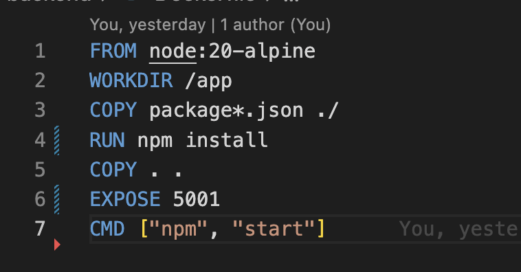


### .dockerignore

```
node_modules
.git
.github
.env
*.log
junit.xml
```

### Docker Compose (Local Testing)

A `docker-compose.yml` was created to run the app and PostgreSQL together locally:

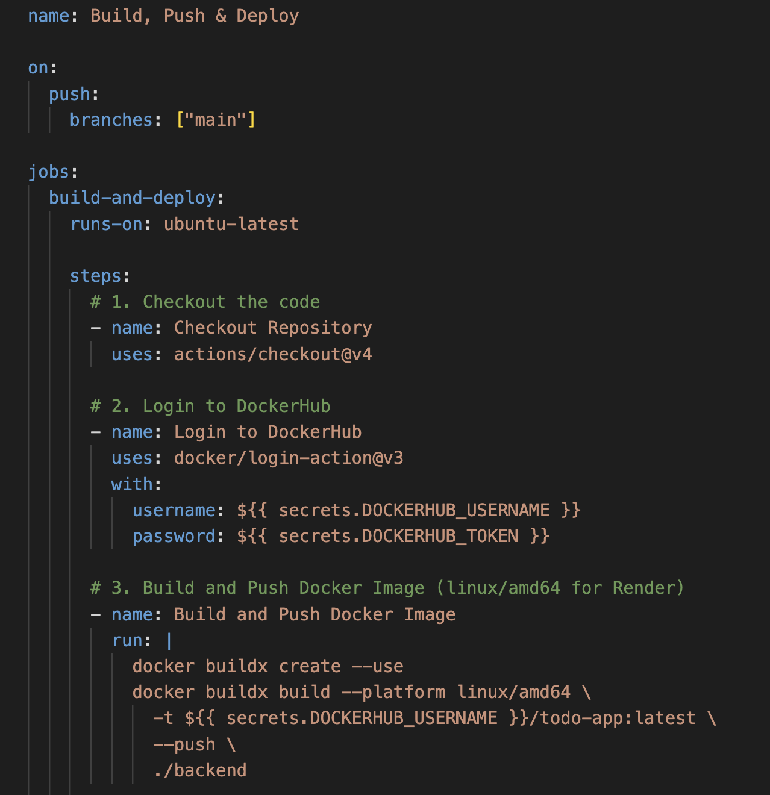

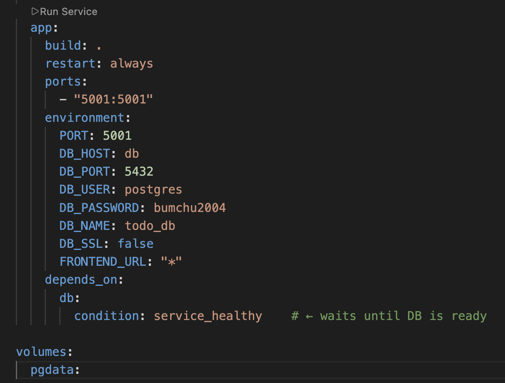


### Local Testing Results

When `docker compose up --build` was executed, the following output was received:

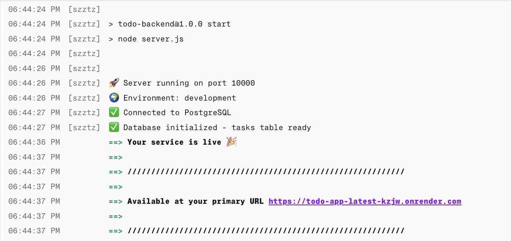

### Building for linux/amd64 (Render Compatibility)

As the computer used for developing this application is Apple Silicon (ARM), it was built on `linux/amd64` platform for compatibility with Render.com:

```bash
docker buildx build --platform linux/amd64 -t yehsey/todo-app:latest --push .
```

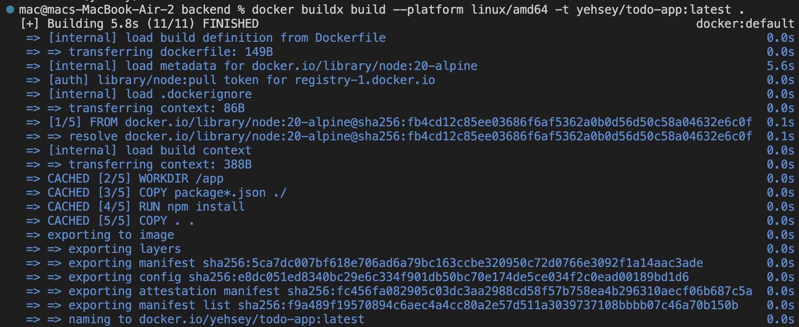

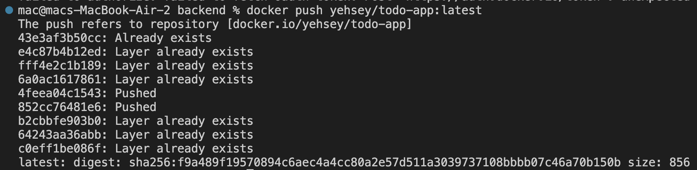

---

## Task 3: GitHub Actions CI/CD Workflow

### GitHub Secrets Added

Three secrets were added to the GitHub repository under **Settings → Secrets and variables → Actions**:

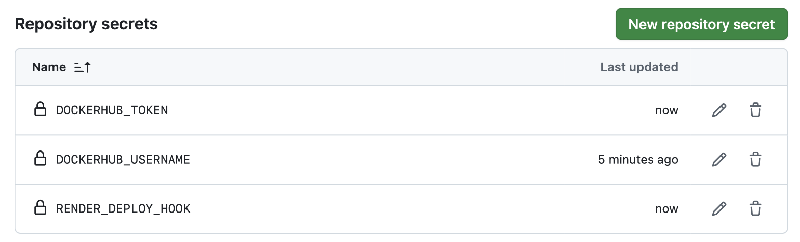


### GitHub Actions Workflow

The workflow file was created at `.github/workflows/deploy.yml`:

```yaml
name: Build, Push & Deploy

on:
  push:
    branches: ["main"]

jobs:
  build-and-deploy:
    runs-on: ubuntu-latest

    steps:
      - name: Checkout Repository
        uses: actions/checkout@v4

      - name: Login to DockerHub
        uses: docker/login-action@v3
        with:
          username: ${{ secrets.DOCKERHUB_USERNAME }}
          password: ${{ secrets.DOCKERHUB_TOKEN }}

      - name: Build and Push Docker Image
        run: |
          docker buildx create --use
          docker buildx build --platform linux/amd64 \
            -t ${{ secrets.DOCKERHUB_USERNAME }}/todo-app:latest \
            --push \
            ./backend

      - name: Trigger Render Deployment
        run: |
          curl -X POST "${{ secrets.RENDER_DEPLOY_HOOK }}"
```

### Workflow Results

Both workflow runs completed successfully with green checkmarks ✅:

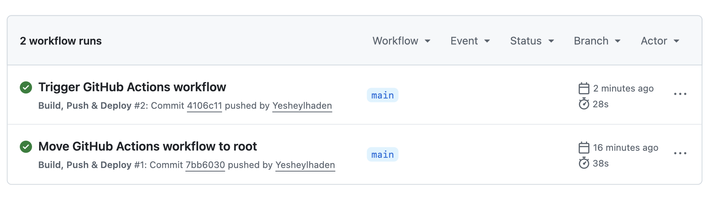

---

## Task 4: Render.com Deployment

### Cloud Database Setup (Neon.tech)

Since the local PostgreSQL cannot be accessed from Render, a free cloud database was created on **Neon.tech**:

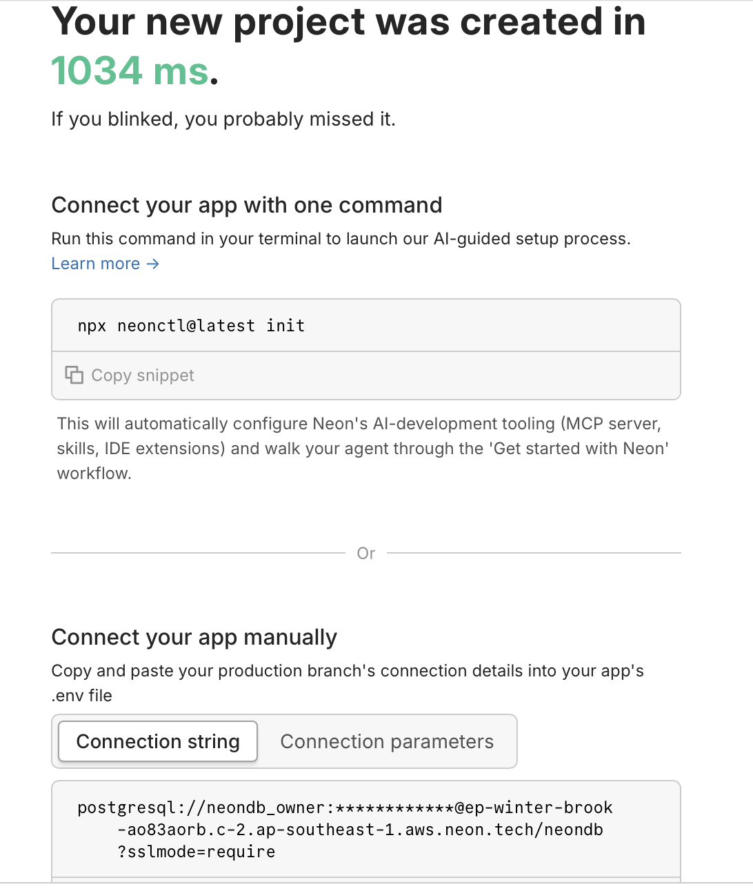

- **Host:** `ep-winter-brook-ao83aorb.c-2.ap-southeast-1.aws.neon.tech`
- **Database:** `neondb`
- **Region:** Singapore (Southeast Asia)

### Render Web Service Configuration

A new Web Service was created on Render.com using the existing DockerHub image:

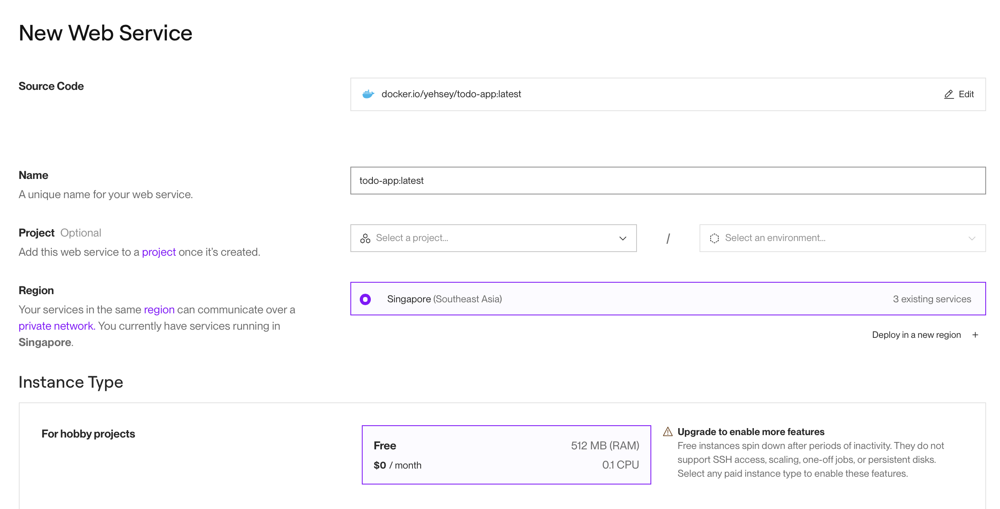

- **Image URL:** `docker.io/yehsey/todo-app:latest`
- **Region:** Singapore
- **Instance Type:** Free
- **Port:** `10000` (Render default)

### Environment Variables on Render

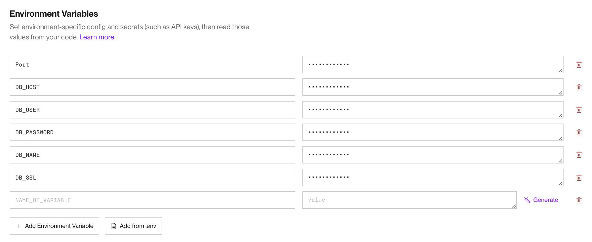

### Render Deploy Hook

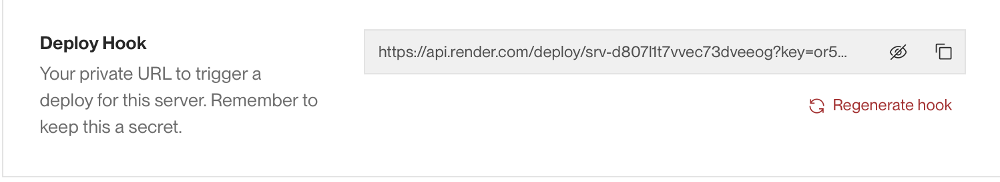

### Deployment Logs

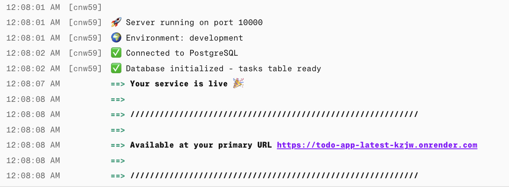

Available at URL https://todo-app-latest-kzjw.onrender.com


### DockerHub Image

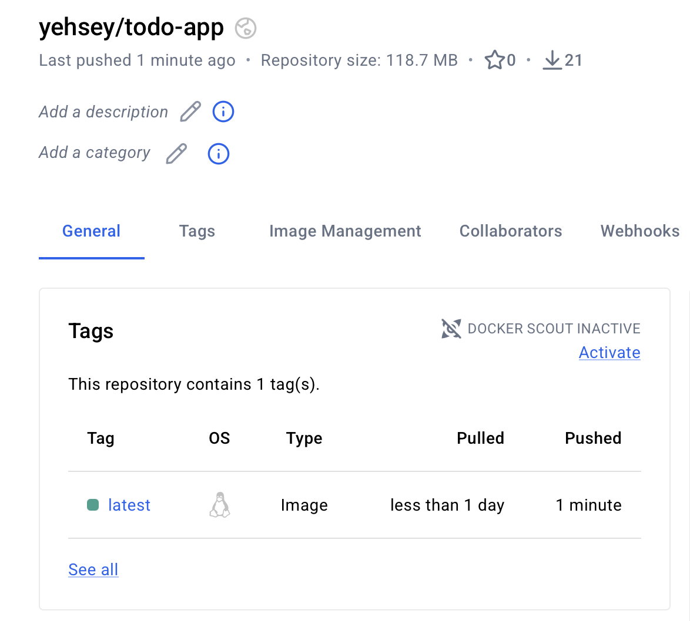

### Live API Endpoints

| Endpoint | Description |
|---|---|
| `https://todo-app-latest-kzjw.onrender.com` | Root API info |
| `https://todo-app-latest-kzjw.onrender.com/health` | Health check |
| `https://todo-app-latest-kzjw.onrender.com/api/tasks` | Get all tasks |

---

## Challenges Faced

### 1. Docker Platform Mismatch
**Problem:** Render.com rejected the Docker image with the error:
```
The provided image URL points to an image with an invalid platform.
Images must be built with the platform linux/amd64.
```
**Solution:** Used `docker buildx build --platform linux/amd64` to build specifically for the AMD64 architecture, since the development machine uses Apple Silicon (ARM).

### 2. Local PostgreSQL Port Conflict
**Problem:** Running `docker compose up` failed because port 5432 was already in use by the local PostgreSQL installation.  
**Solution:** Changed the external port mapping in `docker-compose.yml` from `5432:5432` to `5433:5432`.
### 4. Database Cannot be Reached from Render
**Issue:** Local database using PostgreSQL (`DB_HOST=localhost`) could not be accessed from cloud-based environment provided by Render.  
**Fix:** Setup a new cloud database on **Neon.tech** and configured all environment variables accordingly.

### 5. GitHub Action Workflow is Missing
**Issue:** `.github/workflows/deploy.yml` file got added under the `backend/` directory unintentionally and hence the action workflow wasn't working properly.  
**Fix:** Moved `.github` folder to the repository's root directory as follows:
```bash
mv backend/.github .github
```

### 6. git push Failed With HTTP 408 Error
**Issue:** `git push origin main` was throwing an HTTP 408 timeout error due to file size issue.  
**Fix:** Set Git HTTP buffer size as shown below:
```bash
git config http.postBuffer 524288000
```

---

## Learning Outcomes

## Learning Outcomes

1. **Multi-Platform Docker Build** - Learn how to perform Docker builds for particular platforms (`linux/amd64`) using `docker buildx` on ARM devices (Apple silicon).

2. **Local Multi-Service Orchestrations with Docker Compose** - Practice creating multiple services locally (web app & database) via Docker Compose with dependencies and health checks.

3. **GitHub CI/CD Workflow for Docker Build and Pushing Images** - Learn how to create workflows to automate builds triggered by git pushes, build and push Docker images to registry and redeploy services to cloud.

4. **GitHub Secrets and Security** - Learn about potential security issues when using plain text authentication in your applications and storing them in GitHub Secrets.

5. **Cloud Database Configuration** - Compare performances between local & cloud-based databases and learn how to deploy your application to the free PostgreSQL cloud service (Neon.tech).

6. **Deployment to Cloud Services via Docker Registry** - Learn how to deploy applications to the cloud using services provided at Render.com by deploying Docker container to the web service.

7. **Troubleshooting CI/CD** - Learn how to debug deployment logs and troubleshoot errors, such as port collision, network connectivity issues, multi-platform problems.

## Live Deployment

🌐 **[https://todo-app-latest-kzjw.onrender.com](https://todo-app-latest-kzjw.onrender.com)**

---

## Conclusion
The current assignment offered a great opportunity to gain practical experience in setting up a full-fledged CI/CD pipeline for a containerized Node.js application. The inclusion of the GitHub Actions, Docker, DockerHub, and Render.com services allowed creating an end-to-end fully automated pipeline for a software project.
In essence, upon pushing the main branch, a new Docker image will be created, pushed to the DockerHub service, and then re-deployed at Render.com – entirely without human interaction, which reflects the best real-world DevOps practices.
However, one of the key takeaways from the current assignment was the need to pay attention to the configuration differences associated with different platforms. For example, there was no support for the ARM-based Apple computers by the AMD64-based Render.com platform and vice versa. Similarly, access to a local database became impossible using the cloud-based server service.
Therefore, the conclusion that it is essential to take into account such problems while developing applications to avoid them further on is justified.